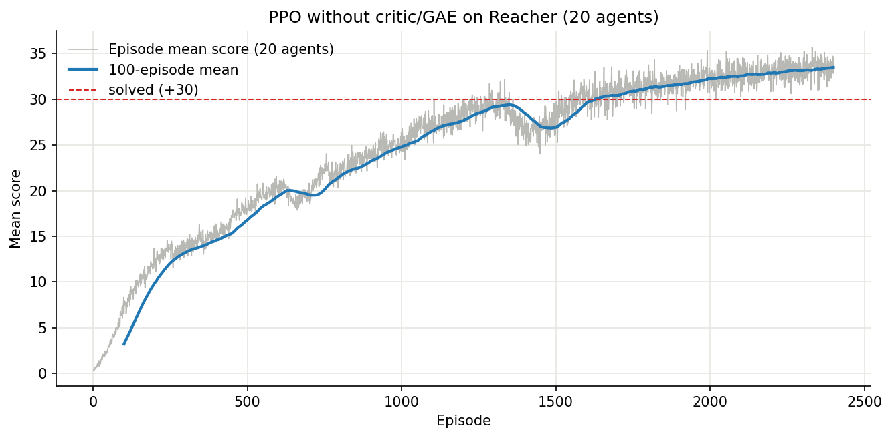

## Description of the implementation

After solving the cartpole gym and Atari pong from pixels with with PPO without GAE/critic, I was curios if the monte carlo baseline estimation, to reduce bias and variance, was good enough to solve the reacher robotics task.

This baseline estimation is better if estimated over multiple envs instead of a single env over time, so I chose to pursue the 20 env / arms task to compensate for the missing critic.
And this turned out to be good enough to actually solve the task.

## Learning Algorithm

The learning algorithm is a simple PPO without critic with 4 SGD steps per 20 envs trajectory unroll. The overall code template is from the pong-PPO.ipynb from the udacity courses deep-rl github repo, so some parts may be similar to there.

The best run I have done with this code lands at a average return of 37. When watching the environment playout, it actually shows that this is extremly close to a perfect score and the end effector of the robots is virtually always in the target ball of all 20 envs.

The original pong-PPO.ipynb code also contains a entropy loss to keep variance and therefore exploring high. When trainig with this, I get the said average return of 37.

For simplicity sake, the submitted code does not contain the entropy term as it already solves the task. However, it goes to show that even for such a "simple" problem the entropy term is important.

## Chosen hyperparameters
The training is extremly sensitive to the learning rate. While I initially tried 1e-4 it was quite slow. 3e-4 is significantly faster but stops learning at a average reward of about 31.

I then chose to retrain from scratch with a simple learning schedule going from a 5e-4 to 1e-4. These are hard changes every 400 steps of 1e-4. They can also be seen in the learning curve as dips.

Other hyper parameters:
Discount at 0.99, epsilon at 0.1 and epsilon decay at 0.999, all left unchanged from the pong-PPO.ipynb from the course.

# Model Architecture

Simple 3 layer ReLU-MLP with TanH head. Hidden layer dimensions are 128. So (33-128-128-4)
The weights and biases of the first two layers are being initialized with a Kaiming normal distribution. This greatly increased the initial learning speed. Otherwisee there is a long plateu. The last layer is, like in He et al. 2015, initialized with a uniform distribution and the biases are set to 0.

# Plot of rewards

# Outlook future ideas

- Use schedulefree or other learning rate schedules; especially smooth transitions in the learning rate should make the learning curve more predictable
- Use SPO (Simple Policy Optimization) 2026
    Already tried (simple change in the loss function) but it did not converge as fast as PPO
- Add a critic with GAE to see how much it improves the training speed
- Increase size of Policy MLP to see if this improves training speed